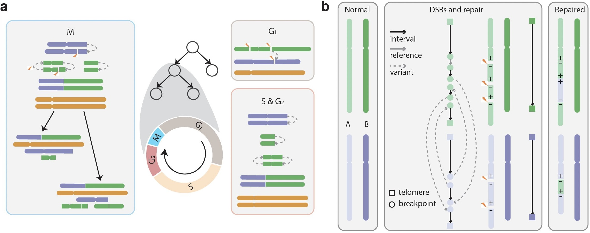

# Introduction
This program simulates human cell divisions with a stochastic birth-death branching process.
It can generate double strand breaks and repair some or all of them in a complete cell cycle.
It can output copy number alterations (CNAs) and structural variants (SVs) for all cells in the final population and their summary statistics.




The full description of the method and its applications are described in: \
Bingxin Lu, Samuel Winnall, William Cross, Chris P. Barnes (2023). Cell-cycle dependent DNA repair and replication unifies patterns of chromosome instability. [bioRxiv](https://doi.org/10.1101/2024.01.03.574048).

The simulated and real data used for the analysis in the above manuscript are available at
[Zenodo](https://doi.org/10.5281/zenodo.10114638).


## Required library for the simulation program
* [GSL](https://www.gnu.org/software/gsl/)
* [BOOST](https://www.boost.org)


# Installation
The simulation program has been tested on the latest versions of *nix systems, including:
* macOS Sonoma 14.3.1, GSL 2.7.1, BOOST 1.83.0
* Red Hat Enterprise Linux Server (Maipo) 7.8, GSL 2.4, BOOST 1.53.0 
* CentOS Linux (Core) 7, GSL 2.5, BOOST 1.53.0 


## Compilation
Download the source code and then run `make` in folder "src" to generate the simulation program 'simsv' in a few seconds.
The simulation program 'simsv' will be stored in a new folder called "bin".


# Usage
Please run `./simsv -h` for all options.

Please run `bash script/run_sv.sh` for an example, which will generate simulated data with the given parameters in less than one second or a bit longer depending on the system.
The output will be stored in a new folder called "example".


## Input
The program takes an input file containing the size of the reference genome.
Please see hg38_size.tsv in folder "data" for example.
This file contains the chromosome name, the end position of the chromosome, the	boundary between p arm and q arm,	the start and end positions of centromere, and the start and end positions of telomere.  

The arm boundary is used to get the arm-level total copy numbers, which are used to derive the cell fitness. 

The positions of centromeres are used to determine the number of centromeres in a connected genomic segment (path), which is used for mitosis. 

The positions of telomeres are used to determine the presence of telomeres in a connected genomic segment (path), which is used for genomic fusion. 

For simplicity, no breakpoints are allowed in centromeres and telomeres.


### Important input parameters
* `-n `: number of cells in the simulated population
* `--div_break `: maximum ID of cell division when double strand breaks occurs
* `--dsb_rate`: mean number or rate of double strand breaks per cell division
* `--n_dsb`: number of double strand breaks introduced in G1, which will be overridden by dsb_rate > 0
* `--frac_unrepaired`: fraction of unrepaired double strand breaks in G1
* `--n_local_frag`: mean number of double strand breaks introduced by local fragmentation during mitosis
* `--prob_wgd`: probability of whole genome doubling
* `--chr_prob`: the types of assigning probability of double strand breaks
* `--fchr_prob`: the file containing the probability of double strand breaks on each chromosome


### Optional input files
* `--fbp `: TSV file with breakpoints to sample from when introducing new DSBs, with the header being chrom1, bp1, strand1, chrom2, bp2, strand2, and frequency(optional). 
* `--fbp_common`: TSV file with initial clonal SVs, where breakpoints should be unique


## Output 
The program will generate a list of summary statistics to the standard output for inference with Approximate Bayesian Computation (ABC), including
* the percentage of genome altered (PGA) for total and haplotype A/B copy number alterations 
* the mean and standard deviation of pairwise divergence for total and haplotype A/B copy number alterations 
* the frequency distribution of breakpoints present in different numbers of cells
* the fraction of cells with WGD
* the fraction of different types of SVs (deletion, duplication, inversions, and intra-chromosomal SVs)


In addition, several files may be generated depending on the output options specified by the user.
* sumStats_sim* : files including summary statistics for the whole simulation 
* sumStats_total_c* : files including summary statistics for each cell 
* sumStats_chrom_c* : files including summary statistics for each chromosome in each cell 
* CNData_*: files including copy numbers for each cell, format compatible with [ShatterSeek](https://github.com/parklab/ShatterSeek)
* SVData_*: files including SVs for each cell, format compatible with [ShatterSeek](https://github.com/parklab/ShatterSeek)
* c*/rck.acnt.tsv: files including copy numbers for each cell, format compatible with [RCK](https://github.com/aganezov/rck)
* c*/rck.scnt.tsv: files including SVs for each cell, format compatible with [RCK](https://github.com/aganezov/rck)
* genome_c\*_div\*.tsv: files including the genomic segments, including ID, shape (linear or circular),	type (depending on the number of telomeres),	Ncentromere, nodes (list of segments separated by breakpoints),	size (total number of bases).

### Data fitting with ABC

Please see scripts in folder "script/abc" for how to run ABC on simulated and real data.


### Visualize output
The script `visualize_sv.R` provides several visualization functions of the data.

Please see the following scripts in folder "script" for how to generate the plots in the manuscript.
* Fig 1: plot_demo_model.R
* Fig 2: parse_bfb.R, check_cmplxy.R, parse_pcn.R
* Fig 3: count_sv.R
* Fig 4: parse_ecdna.R
* Fig 5: abc/check_abc_sc_sim.R
* Fig 6: abc/check_abc_sc_real.R


### Major algorithms

The cell division process is implemented in cell.hpp, mainly including _g1_, _sphase\_g2_, and _mitosis_.

Algorithm for simulating G1 phase:
```{r, tidy=FALSE, eval=FALSE, highlight=FALSE }
g1
    // genearate the DSBs
    i = 0
    while i < #(DSBs to introduce) do
        find all the unique intervals in the genome
        randomly select the position of the DSB
        generate the breakpoints 
        i = i + 1
    end 

    find breakpoints to be repaired R

    // repair the DSBs
    while there is unrepaired breakpoints in R do
        randomly select a breakpoint b1 from R
        select another breakpoint b2 from R either randomly or according to its distance to b1
        update the relevant adjacencies
        remove b1 and b2 from R
    end 
   
    get the rearranged genome
```

Algorithm for simulating S phase and G2 phase:
```{r, tidy=FALSE, eval=FALSE, highlight=FALSE }
sphase_g2:
    while there is a path not duplicated do
        if path is linear and incomplete (lacking telomeres) then
            replicate the path and connect it to the copy, forming a fusion
        else
            replicate the path 
        end 
        move on to the next path
    end
```

Algorithm for simulating M phase:
```{r, tidy=FALSE, eval=FALSE, highlight=FALSE }
mitosis:
    introduce whole genome doubling if specified
    while there is a path not distributed to daughter cells do
        if there is one centromere then
            distribute the path to one of the daughter cells
        else if there is no centromere then
            randomly distribute the path to a daughter cell
        else
            break the path so that each subpath has only one centromere
        end 
    end
```